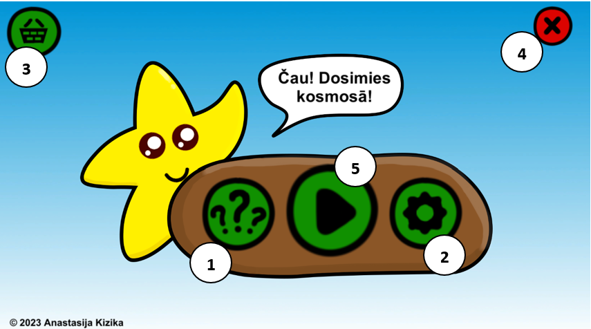
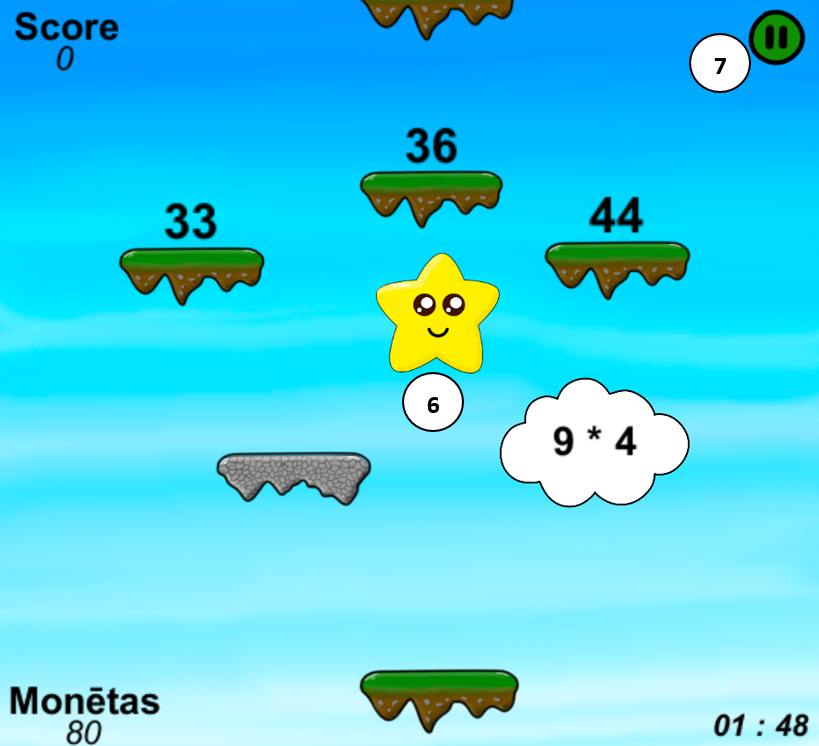
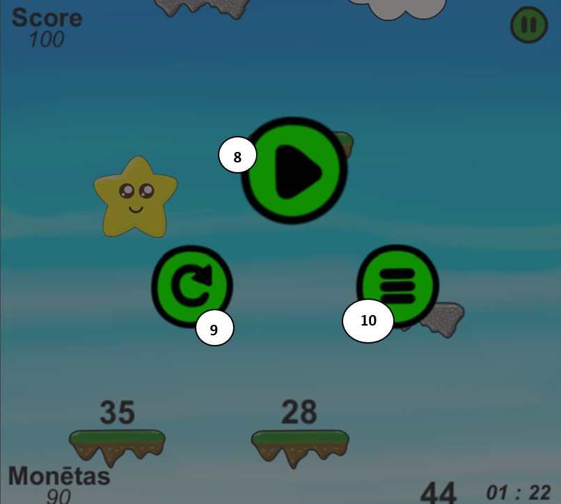
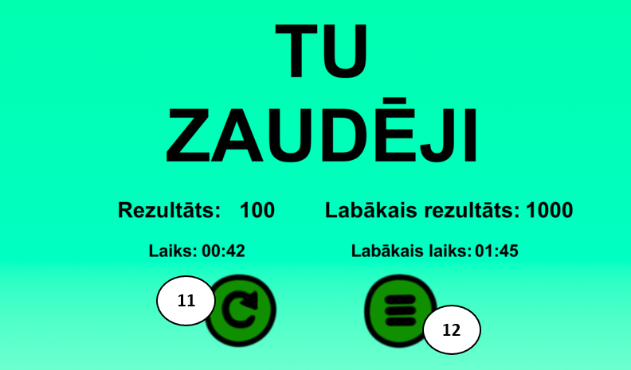
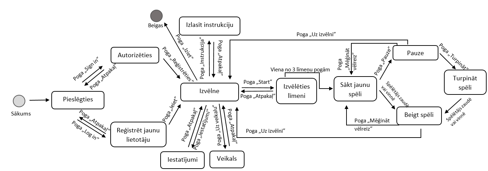

# Auzraujoša matemātika

**Auzraujoša matemātika** is an educational computer game designed for elementary school children. It is a platformer game created to help children develop counting skills in an engaging and interactive way. The game is built using *Unity* game engine.

## Installation

To install **Auzraujoša matemātika**, follow these steps:

1. Click on the following link: [Download Auzraujoša matemātika](https://failiem.lv/f/2vu69qjnga).

2. Download the repository.

3. Unzip the downloaded file.

4. Open the unzipped folder.

5. In folder Game_1.1.0 run the "Math Game" file to start playing the game.

## Gameplay

In **Auzraujoša matemātika**, players control a character who jumps across platforms upwards while solving mathematical examples. The objective is to solve all the examples to pass the level, reach space, and earn coins to buy new characters.

Throughout the game, players continuously solve addition, subtraction, multiplication, and division examples to know which platform to jump to avoid falling. Player can choose which types of examples he want to solve (+ - * /). Different levels may introduce challenges that require players to solve examples faster and faster.

The game is dynamic, helping children develop mental calculation skills while also develops reaction and logical thinking. Players must strategize to reach the correct platform without touching the one with the wrong answer.

## Features

- EDUCATIOANL platformer game
- Mathematical examples on multiplication, division, addition, and subtraction
- 3 levels of difficulty
- Ability to choose which types of examples to solve
- Character shop, colorful graphics
- Intuitive controls
- Player authentication, saving their best scores, coins, and purchased characters

## System Requirements

- Operating System: Windows 8 and later
- Memory: 200 MB free space

## How to Use

To connect to the system, open the "Math Game" application. Then enter the login, password, and click the "Ieiet" button or register a new player and click the "Reģistrēties" button.

After successful authentication, the player will see the game menu interface, with the following options available:
1. Read the game rules
2. Configure which types of problems the player will solve
3. Go to the shop
4. Close the game
5. Start the game

By clicking the "Start Game" button (5), the player can choose one of the three levels and start the game. Then he will see the game interface, which includes:

6. Active player that can be controlled using arrow keys (left, right)
7. Pause button

By clicking on pause, the player can:

8. Continue the game
9. Restart
10. Go back to the menu

At the end of the game (whether the player wins or loses), he will see his results and can:

11. Restart the same level
12. Return to the menu

## Game State Diagram

## Authors

**Auzraujoša matemātika** was created by:

- Anastasija Kizika and Sofja Kizika, students of Rezekne State Gymnasium No 1.

## Licence

Educational game "Aizraujoša matemātika" © 2024 by Anastasija Kizika is licensed under [CC BY-SA 4.0](https://creativecommons.org/licenses/by-sa/4.0/?ref=chooser-v1)
